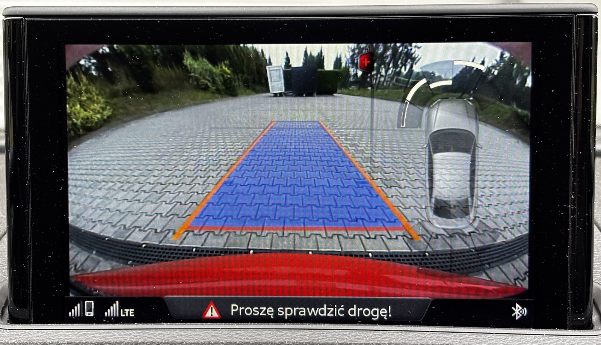

# Audi MHI2 RVC fullscreen (Audi-MHI2-RVC-fullscreen)
Audi MIB2 MMI (MHI2) rear-view camera modification for fullscreen stream display

Replace `displaymanager.json`, `.png` textures and `.kzb` assets to change video stream and  update GUI.

Full details: http://wiki.mib-helper.com/index.php?title=Audi_MHI2_RVC_fullscreen_patch

## Supported Vehicles ##
* Audi A3/S3/RS3 (8V) with MHI2 system running firmware `MHI2_ER_AU37x_P5089`.
* Need support for other cars and want to help develop the mod? Post stock files and display picture with stock config.

## Procedure
* download assets from this repository
* upload  assets to Audi MIB2 MMI unit
* reboot the unit
* check if it works and enjoy!

## Important
* Not for commecrial use - if you bought this, you got ripped off!
* Use at your own risk.
* Create backups before doing anything.
* Developed and tested with `MHI2_ER_AU37x_P5089`

## Most important commands
* `ssh root@10.173.189.1` - connect with MIB2 at 10.173.189.1 IP address (WLAN hotspot)
* `ssh root@x.x.x.x` - connect with MIB2 at x.x.x.x IP address (D-Link Ethernet-to-USB adapter)
* `4SapmKoq` - root password for MU1326
* `mount -uw /net/mmx/mnt/app && mount -uw /net/mmx/mnt/system` - enable write filesystem
* `mount -ur /net/mmx/mnt/app && mount -ur /net/mmx/mnt/system` - go back to read-only filesystem
* `exit` - log out from MIB